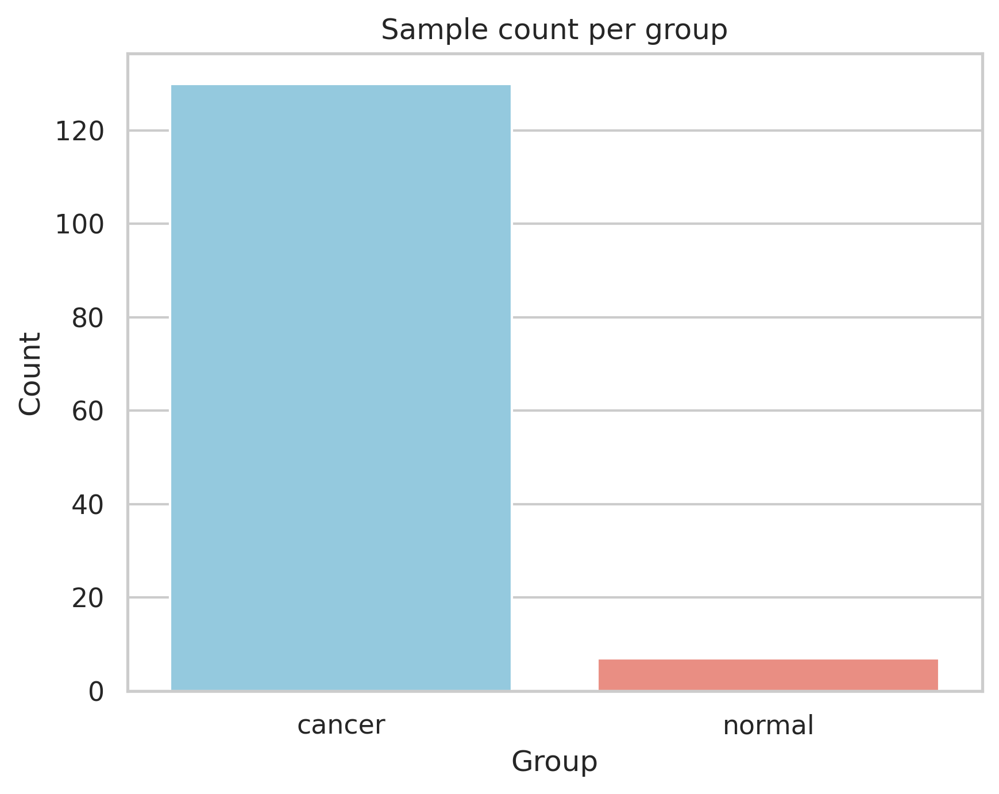
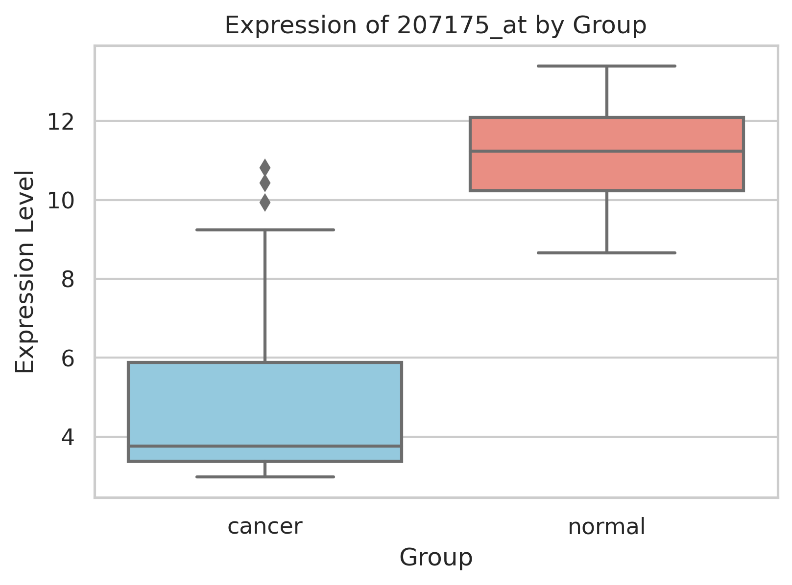
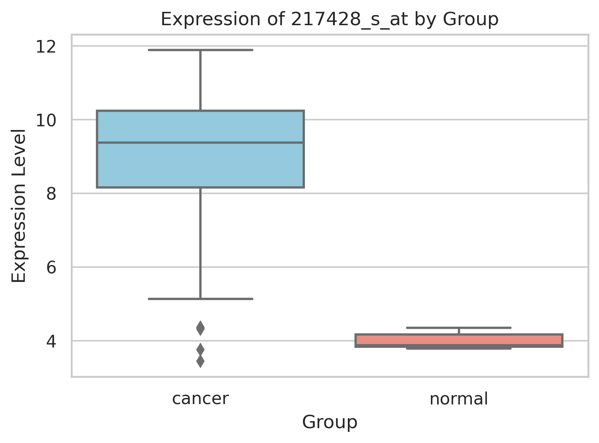
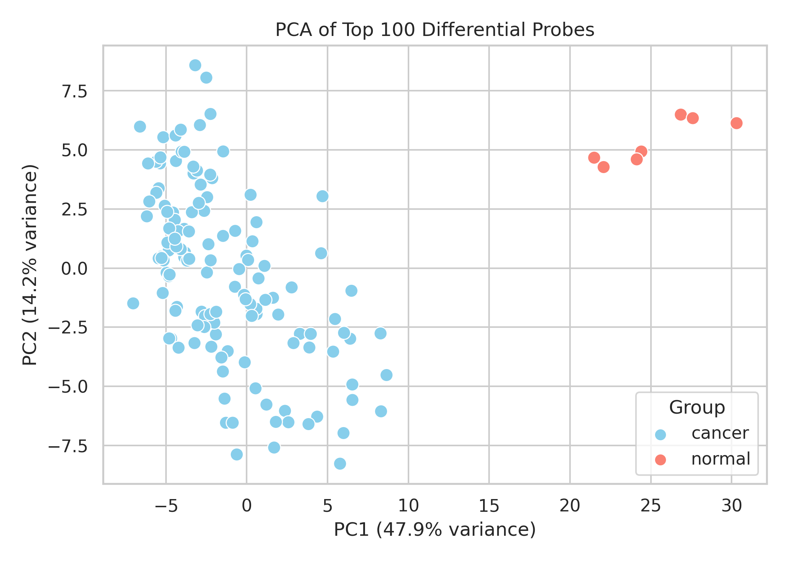

# 🧬 Breast Cancer Gene Expression Analysis

This repository contains an analysis of gene expression data from breast cancer tissue and normal samples. The goal is to identify genes that significantly differentiate between cancerous and non-cancerous states and understand their biological roles.

---

## 1. Dataset Overview

The dataset is derived from the [CUMIDA Breast Cancer Gene Expression Dataset (GSE45827)](https://www.kaggle.com/datasets/brunogrisci/breast-cancer-gene-expression-cumida).  
It contains:

- **151 samples**: both normal tissue and various cancer subtypes
- **54,000+ probes** (Affymetrix probe IDs like `207175_at`, `217428_s_at`)
- Column `type`: denotes group (`normal`, `cell_line`, `basal`, `HER`, `luminal_A`, `luminal_B`)

🎯 Only normal vs cancerous samples were used in the current analysis.

---

## 2. Exploratory Data Analysis (EDA)

### Sample Distribution
Count of samples per group was visualized to confirm class balance.

---

## 3. Differential Expression Analysis

Each probe's expression was compared between `normal` and `cancer` groups using:

- Group-wise mean
- Log2 fold change
- Independent t-tests

Top differentially expressed probes were identified by absolute `log2FC` and statistical significance.

📁 Full Table: [`data/differential_expression_results.csv`](data/differential_expression_results.csv)

**🔍 Preview of Differential Results**

| probe_id     | mean_normal | mean_cancer | log2FC   | p_value   |
|--------------|-------------|-------------|----------|-----------|
| 207175_at    | 11.13       | 4.73        | -1.23    | 2.50e-05  |
| 217428_s_at  | 4.00        | 8.99        | +1.16    | 3.44e-39  |
| ...          | ...         | ...         | ...      | ...       |

---

### Gene Expression Boxplots

Top probes were visualized using boxplots to illustrate differences in expression between groups.

Example:

- `207175_at` (downregulated)
- `217428_s_at` (upregulated)

  

---

## 4. Dimensionality Reduction (PCA)

PCA was performed using top 100 probes by absolute `log2FC`:

- PC1 separates normal and cancer groups
- Shows the discriminative power of selected features

---

## 5. Gene Annotation & Mapping

To provide biological meaning, probes were mapped to gene symbols using the [GPL570 annotation file](https://www.ncbi.nlm.nih.gov/geo/query/acc.cgi?acc=GPL570).

Each probe was linked to:

- Gene symbol
- Gene title
- Functional description (if available)

📁 Annotated Table: [`data/annotated_differential_results.csv`](data/annotated_differential_results.csv)

**🔍 Preview of Annotated Results**

| probe_id     | gene_symbol | gene_title                                     | log2FC  | p_value |
|--------------|-------------|------------------------------------------------|---------|---------|
| 207175_at    | DDR1        | discoidin domain receptor tyrosine kinase 1    | -1.23   | 2.50e-05|
| 217428_s_at  | FOXQ1       | forkhead box Q1                                | +1.16   | 3.44e-39|
| ...          | ...         | ...                                            | ...     | ...     |

---

## 6. Probe-to-Gene Redundancy

Some genes are represented by multiple probes. These were identified to assess robustness and redundancy in differential expression.

📁 Summary: [`data/repeated_gene_symbols.csv`](data/repeated_gene_symbols.csv)

**🔁 Preview of Repeated Genes**

| gene_symbol                         | count |
|-------------------------------------|-------|
| HFE                                 | 15    |
| TCF3                                | 13    |
| LOC100506403 /// RUNX1              | 13    |
| CD44                                | 13    |

---
## 7. Master Table for Visualization & Looker Studio

To support downstream visualization and interactive analysis, a final **master table** was generated by combining:

- Differential expression results
- Probe-to-gene annotation
- Redundant gene detection
- Expression direction classification

### 🔧 Columns Included

| Column             | Description                                                   |
|--------------------|---------------------------------------------------------------|
| `probe_id`         | Affymetrix probe identifier                                   |
| `Gene Symbol`      | Mapped gene symbol                                            |
| `Gene Title`       | Gene full name or description                                 |
| `log2FC`           | Log2 fold-change (cancer vs. normal)                          |
| `p_value`          | Raw p-value from t-test                                       |
| `neg_log10_pvalue` | –log10 transformed p-value (used in volcano plot)             |
| `mean_normal`      | Average expression in normal samples                          |
| `mean_cancer`      | Average expression in cancer samples                          |
| `redundant`        | Boolean flag if gene is represented by multiple probes        |
| `group`            | Expression direction: `up`, `down`, or `neutral`              |

📁 **File**: [`data/master_table_looker_ready.csv`](`data/master_table_looker_ready.csv`)

---

## 📜 License

This project is released under the MIT License.
