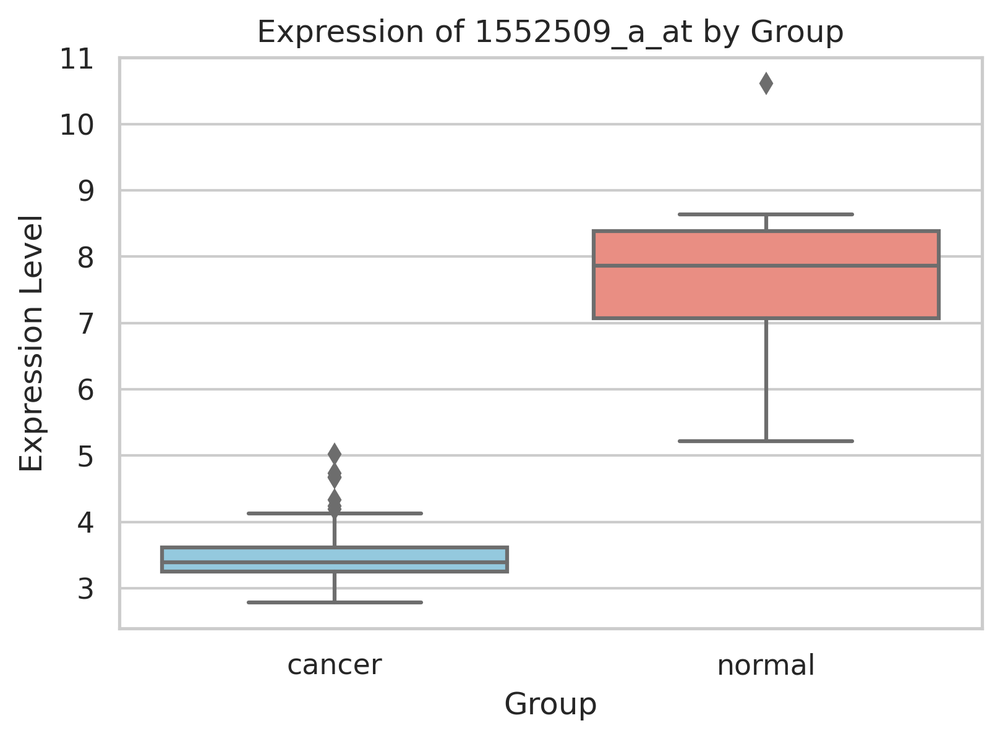
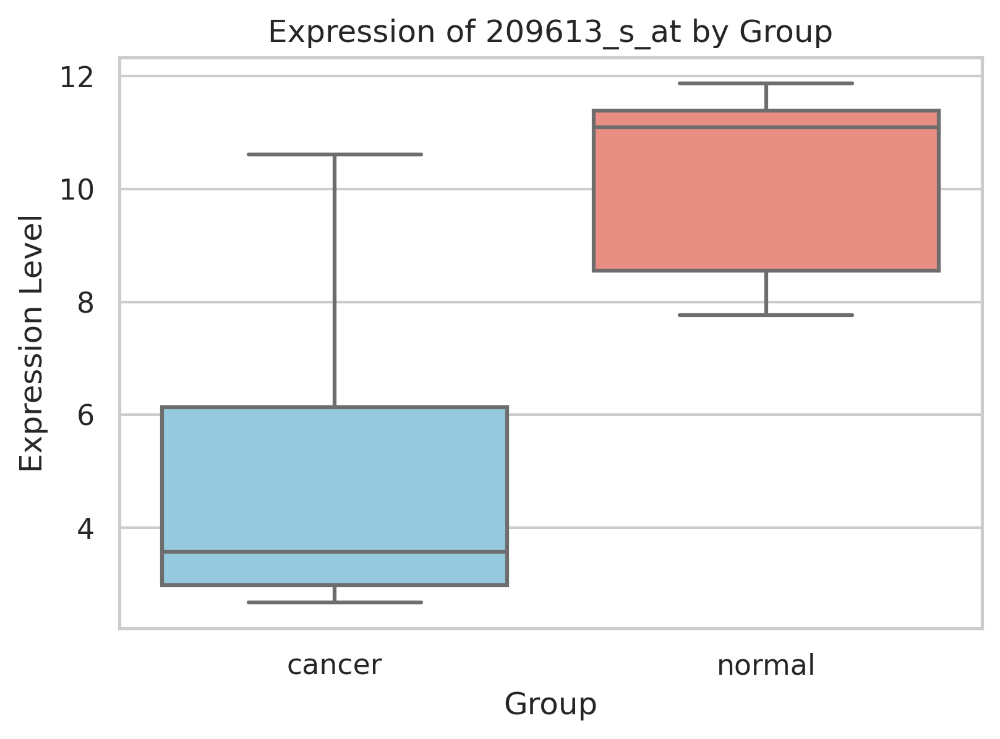
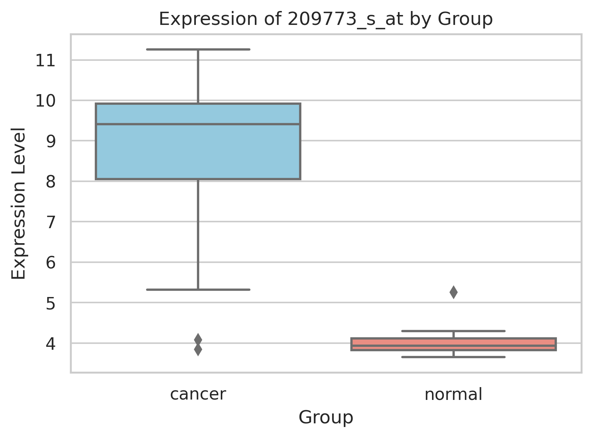

# 🧬 Breast Cancer Gene Expression Analysis

This project analyzes gene expression data to identify the most differentially expressed features  
between **cancer** and **normal** breast tissue samples.

Analysis is conducted in a single notebook:  
📒 [`notebooks/breast-cancer-gene-expression-analysis.ipynb`](notebooks/breast-cancer-gene-expression-analysis.ipynb)

---

## 🎯 Objective

To identify probe sets (gene expression features) that most clearly distinguish cancer from normal tissue,  
using basic data analysis, statistical testing, and visualization techniques.

---

## 📦 Dataset

- **Source**: [Kaggle: CUMIDA Breast Cancer Dataset](https://www.kaggle.com/datasets/brunogrisci/breast-cancer-gene-expression-cumida)
- **File**: `Breast_GSE45827.csv`
- **Samples**: 151
- **Features**: ~54,000 probe sets (e.g., `1007_s_at`, `1053_at`)
- **Groups**:  
  - `normal` — healthy tissue  
  - `cancer` — all tumor subtypes (excluding `cell_line`)

---

## 📈 Analysis Pipeline

### 🧬 1. Dataset Preparation

- Removed lab-grown `cell_line` samples
- Created binary column `group` → `normal` / `cancer`
- Checked class distribution

**📊 Sample Count by Group**  
Distribution of samples across `normal` and `cancer` categories.  

---

### 📊 2. Exploratory Data Analysis

- Visualized expression levels of selected probes
- Calculated group-wise averages for each probe
- Computed **log2 fold change**
- Applied **independent t-tests** to each probe

Results were aggregated into a summary table.

📁 [`data/differential_expression_results.csv`](data/differential_expression_results.csv)

---

### 📦 3. Visualization of Top Features

Top 5 probe sets with strongest expression differences (based on `abs(log2FC)`) were selected and visualized:

**🧪 Boxplots of Top 5 Differentially Expressed Probes**  
Each plot compares expression levels between `normal` and `cancer` for a single probe set.

| Probe ID         | Visualization |
|------------------|---------------|
| `207175_at`      |  |
| `217428_s_at`    |  |
| `1552509_a_at`   |  |
| `209613_s_at`    |  |
| `209773_s_at`    |  |

---

### 🧠 4. PCA Visualization

PCA (Principal Component Analysis) was applied using the top 100 most differential features  
to explore class separation in 2D space.

**📌 PCA on Top 100 Probes**  
Each point represents a sample, colored by group (`cancer` / `normal`).

---

### 📄 5. Final Summary & Export

The top 20 probe sets with the strongest differences were extracted, sorted, rounded and exported:

📁 [`data/top20_differential_probes.csv`](data/top20_differential_probes.csv)

This table serves as the final ranked list of features most relevant for distinguishing cancer from normal tissue.

**🧾 Preview of Final Table**  
Each row represents a probe set with its expression values, log2 fold change, and significance.

---

## 🚧 Next Steps

- Build an interactive dashboard in **Looker**
- Add probe-to-gene annotation (e.g., Ensembl or NCBI)
- Extend to classification or biomarker selection
- Update README with dashboard visuals

