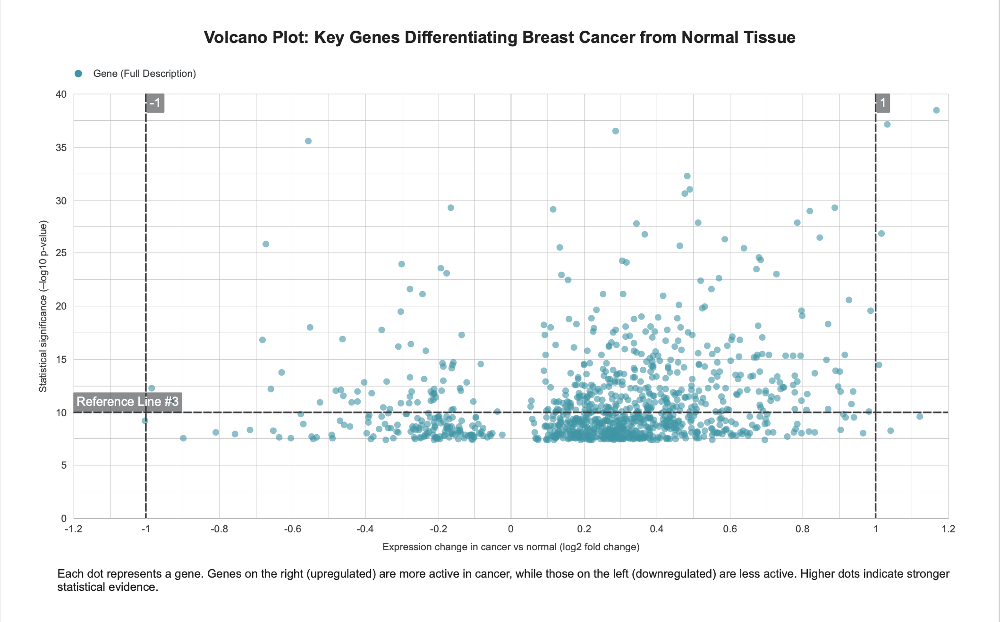
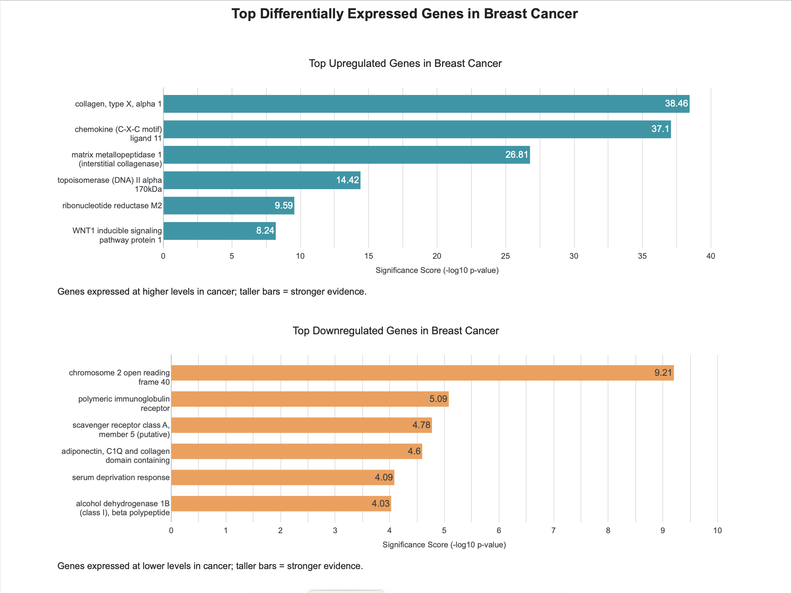

# 🧬 Breast Cancer Gene Expression Analysis

This repository contains an analysis of gene expression data from breast cancer tissue and normal samples. The goal is to identify genes that significantly differentiate between cancerous and non-cancerous states and understand their biological roles.

---

## 1. Dataset Overview

The dataset is derived from the [CUMIDA Breast Cancer Gene Expression Dataset (GSE45827)](https://www.kaggle.com/datasets/brunogrisci/breast-cancer-gene-expression-cumida).  
It contains:

- **151 samples**: both normal tissue and various cancer subtypes
- **54,000+ probes** (Affymetrix probe IDs like `207175_at`, `217428_s_at`)
- Column `type`: denotes group (`normal`, `cell_line`, `basal`, `HER`, `luminal_A`, `luminal_B`)

🎯 Only normal vs cancerous samples were used in the current analysis.

---

## 2. Exploratory Data Analysis (EDA)

### Sample Distribution
Count of samples per group was visualized to confirm class balance.

---

## 3. Differential Expression Analysis

Each probe's expression was compared between `normal` and `cancer` groups using:

- Group-wise mean
- Log2 fold change
- Independent t-tests

Top differentially expressed probes were identified by absolute `log2FC` and statistical significance.

📁 Full Table: [`data/differential_expression_results.csv`](data/differential_expression_results.csv)

**🔍 Preview of Differential Results**

| probe_id     | mean_normal | mean_cancer | log2FC   | p_value   |
|--------------|-------------|-------------|----------|-----------|
| 207175_at    | 11.13       | 4.73        | -1.23    | 2.50e-05  |
| 217428_s_at  | 4.00        | 8.99        | +1.16    | 3.44e-39  |
| ...          | ...         | ...         | ...      | ...       |

---

### Gene Expression Boxplots

Top probes were visualized using boxplots to illustrate differences in expression between groups.

Example:

- `207175_at` (downregulated)
- `217428_s_at` (upregulated)

  

---

## 4. Dimensionality Reduction (PCA)

PCA was performed using top 100 probes by absolute `log2FC`:

- PC1 separates normal and cancer groups
- Shows the discriminative power of selected features

---

## 5. Gene Annotation & Mapping

To provide biological meaning, probes were mapped to gene symbols using the [GPL570 annotation file](https://www.ncbi.nlm.nih.gov/geo/query/acc.cgi?acc=GPL570).

Each probe was linked to:

- Gene symbol
- Gene title
- Functional description (if available)

📁 Annotated Table: [`data/annotated_differential_results.csv`](data/annotated_differential_results.csv)

**🔍 Preview of Annotated Results**

| probe_id     | gene_symbol | gene_title                                     | log2FC  | p_value |
|--------------|-------------|------------------------------------------------|---------|---------|
| 207175_at    | DDR1        | discoidin domain receptor tyrosine kinase 1    | -1.23   | 2.50e-05|
| 217428_s_at  | FOXQ1       | forkhead box Q1                                | +1.16   | 3.44e-39|
| ...          | ...         | ...                                            | ...     | ...     |

---

## 6. Probe-to-Gene Redundancy

Some genes are represented by multiple probes. These were identified to assess robustness and redundancy in differential expression.

📁 Summary: [`data/repeated_gene_symbols.csv`](data/repeated_gene_symbols.csv)

**🔁 Preview of Repeated Genes**

| gene_symbol                         | count |
|-------------------------------------|-------|
| HFE                                 | 15    |
| TCF3                                | 13    |
| LOC100506403 /// RUNX1              | 13    |
| CD44                                | 13    |

---
## 7. Master Table for Visualization & Looker Studio

To support downstream visualization and interactive analysis, a final **master table** was generated by combining:

- Differential expression results
- Probe-to-gene annotation
- Redundant gene detection
- Expression direction classification

### 🔧 Columns Included

| Column             | Description                                                   |
|--------------------|---------------------------------------------------------------|
| `probe_id`         | Affymetrix probe identifier                                   |
| `Gene Symbol`      | Mapped gene symbol                                            |
| `Gene Title`       | Gene full name or description                                 |
| `log2FC`           | Log2 fold-change (cancer vs. normal)                          |
| `p_value`          | Raw p-value from t-test                                       |
| `neg_log10_pvalue` | –log10 transformed p-value (used in volcano plot)             |
| `mean_normal`      | Average expression in normal samples                          |
| `mean_cancer`      | Average expression in cancer samples                          |
| `redundant`        | Boolean flag if gene is represented by multiple probes        |
| `group`            | Expression direction: `up`, `down`, or `neutral`              |

📁 **File**: `master_table_looker_ready.csv` 

### 🔍 Preview of Master Table

| probe_id     | Gene Symbol | Gene Title                                     | log2FC  | p_value   | -log10(p) | mean_normal | mean_cancer | redundant | group   |
|--------------|-------------|------------------------------------------------|---------|-----------|-----------|--------------|--------------|-----------|---------|
| 207175_at    | ADIPOQ      | adiponectin, C1Q and collagen domain containing| -1.23   | 2.5e-05   | 4.60      | 11.13        | 4.74         | True      | down    |
| 217428_s_at  | COL10A1     | collagen, type X, alpha 1                      | +1.17   | 3.44e-39  | 38.46     | 4.00         | 8.99         | False     | up      |
| 1552509_a_at | CD300LG     | CD300 molecule-like family member g            | -1.16   | 4.80e-04  | 3.32      | 7.80         | 3.49         | False     | down    |
| 209613_s_at  | ADH1B       | alcohol dehydrogenase 1B (class I), beta       | -1.13   | 9.27e-05  | 4.03      | 10.09        | 4.60         | False     | down    |
| 209773_s_at  | RRM2        | ribonucleotide reductase M2                    | +1.12   | 2.57e-10  | 9.59      | 4.11         | 8.95         | True      | up      |

---
## 8. Results in Looker Studio

To make the results more accessible and interpretable, the master table was connected to **Looker Studio**.  
A one-page dashboard was created to highlight key findings.

### 🔹 Volcano Plot
  
*Scatter plot showing all genes (X = log2FC, Y = –log10 p-value).  
Right/top = significantly upregulated genes; left/top = significantly downregulated genes.*

### 🔹 Top Genes (Bar Charts)
  
- **Top Upregulated Genes in Breast Cancer**  
  *Genes expressed at higher levels in cancer; taller bars = stronger evidence.*  

- **Top Downregulated Genes in Breast Cancer**  
  *Genes expressed at lower levels in cancer; taller bars = stronger evidence.*  

**Dashboard layout:**  
- Single sheet combining Volcano Plot and Top Gene bar charts.  
- Each visualization includes clear titles and short captions for non-technical viewers.

---

## 9. Conclusions

- The analysis confirmed clear differences in gene expression between breast cancer and normal tissue.  
- **Upregulated genes** such as *collagen, type X, alpha 1 (COL10A1)*, *chemokine (C-X-C motif) ligand 11 (CXCL11)*, and *matrix metallopeptidase 1 (MMP1, interstitial collagenase)* are more active in cancer and may serve as potential tumor markers or oncogenes.  
- **Downregulated genes** such as *alcohol dehydrogenase 1B (class I), beta polypeptide (ADH1B)*, *CD300 molecule-like family member 9 (CD300LG)*, and *fatty acid binding protein 4, adipocyte (FABP4)* are less active in cancer and may indicate potential tumor suppressors.  
- The **Volcano Plot** provides an overview of all genes, while the **bar charts** highlight the most statistically significant candidates for further research.  
- This workflow demonstrates a complete junior-level data analysis pipeline: from preprocessing and annotation to statistical testing and dashboard visualization.  

---

## 📜 License

This project is released under the MIT License.
